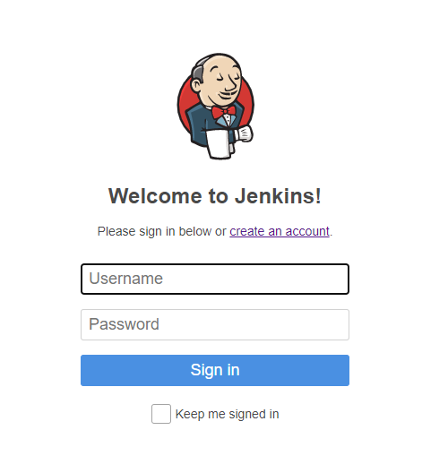
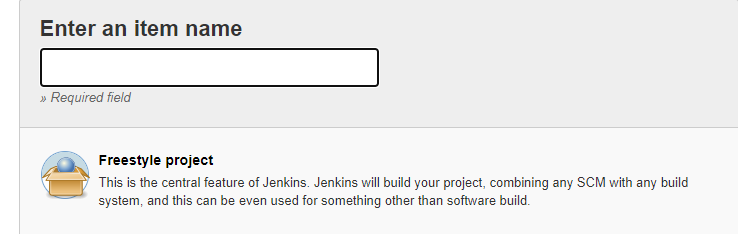
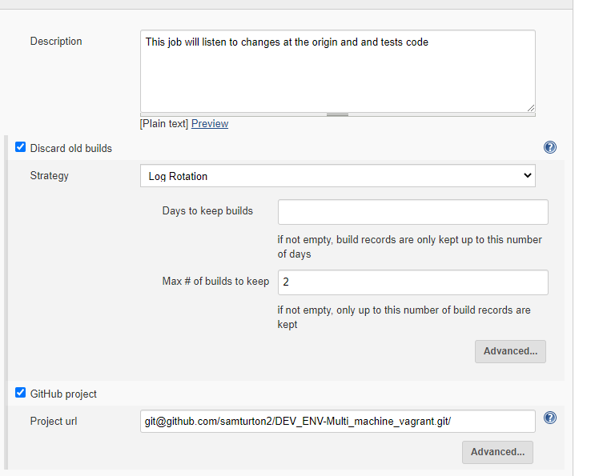
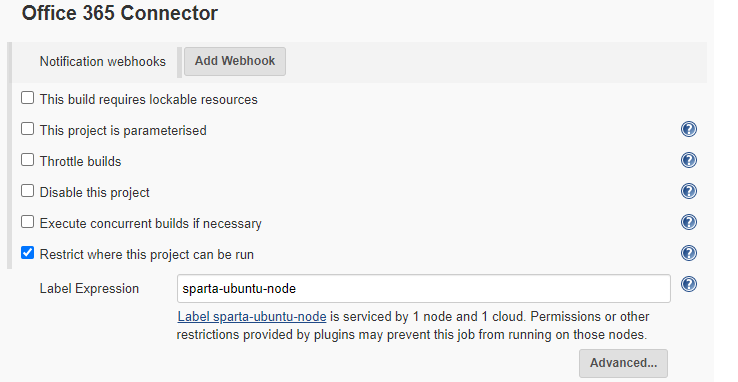
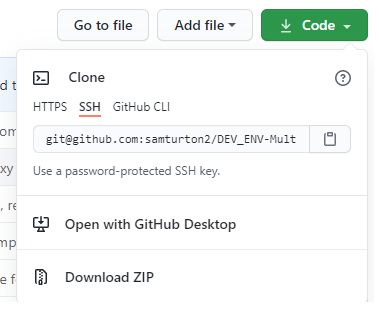
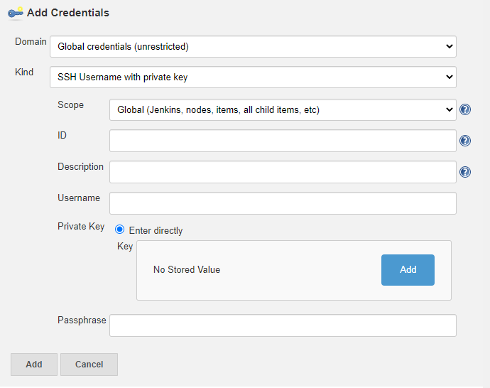
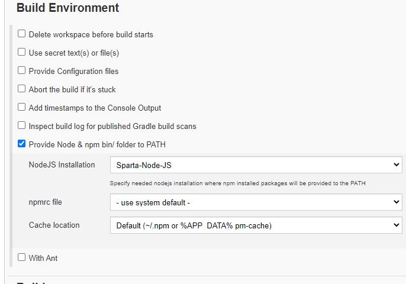
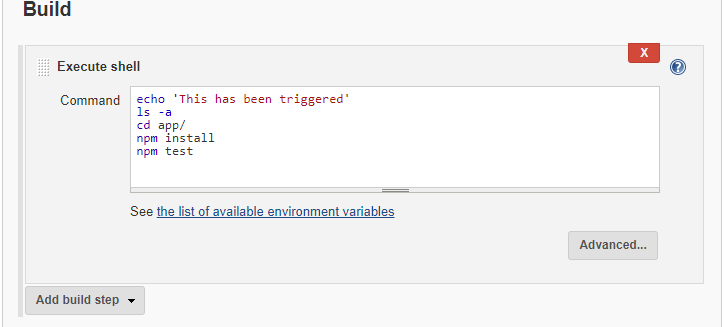
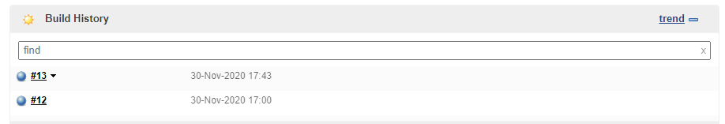
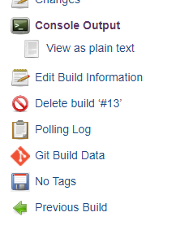

# Jenkins intro
Jenkins is one of the more popular CI/CD automation server. In this read me are instructions to setup and continually test out our multi machine vagrant repo in Jenkins whenever changes are pushed to our repo.

## Login
- First connect to a jenkins server. In this example a server was already set up for us using aws
- You should log in, the page should look like this

## New Item
- Now we need to set up a new item that is connected to our repo with an ssh key and a webhook, so that it can continously check for updates.
- Click on new item (top left, enter your name and choose a freestyle project fr now)

#### General
- Enter a description of the item, and select the general settings you want.
   - In this case we only wanted to keep records of the last 2 builds.
- Also click github project and enter the url of the repo that we are working with.

#### Office 365 Connector
- For now we will only restrict where this project can be run, so it only runs on the sparta test environment (which should be similar to the vagrant development environment we were working with on this app)

#### Source Code Management
- This is the stage we will generate our ssh keys if you haven't already.
- In the terminal generate a private and public key pair with the ssh keygen command. e.g  `ssh-keygen -t ed25519`
    - Enter a logical name for the key
    - You dont need a passphrase for now
- On your github, go to settings/ssh keys, and add the public ssh key you generated to here.
- Next go to your repo and copy the ssh key url

- On jenkins, tick git, and past the url into repo url.
- nder credentials, add a new key, select the kind as ssh, enter a description of the key, tick private key, and copy and paste the private ssh key we generated earlier in here.

- In branched to build make sure its selected as your master or main branch depending on your repo.

#### Build Triggers
- We need to select GitHub hook trigger
- Go to our github repo and select repo settings, and select Webhooks.
  - In here we want to add a new webhook
  - In payload URL enter the base url of our Jenkins Server followed by /github-webhook/ e.g. `http://<baseurl>/github-webhook/`
  - Select send me everything for now and add the webhook

#### Build Environment
- For our app we have node.js installed, so click Provide Node & npm bin to PATH, and select the sparta node js installation.

#### Build
- Now we need to test our app.
- To do this we add a build step and execute a shell command.

- The echo command just lets us know the shell command process has started. 
- The ls -a is a could command to check the directory your in for error handling
- We need to cd into our app folder and run the tests on it to check its running

- Finally click save and the item should show up on the dashboard.

## Trigger build
- make a change to the repo read me and click on our jenkins item.
- The build history should show a blue dot if the tests have passed and a red dot if they have failed.

- We can look at the console output of the build for error handling. Click on the build and click on consol output

- Here we can see if any tests have failed, and make the checges necessesary which should then be triggered by the webhook